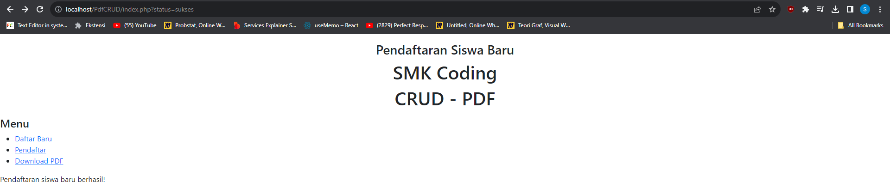
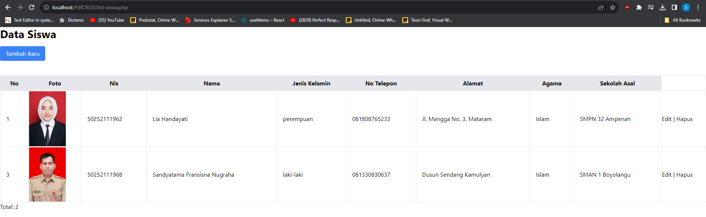
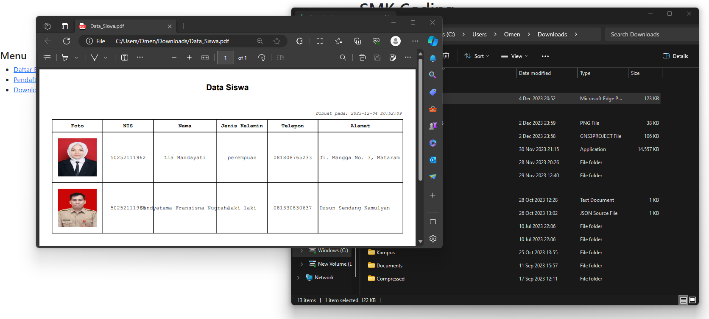

# ImagesUpload

## Make a CRUD Task to Download PDF from MYSQL using php 

### Ini adalah tugas lanjutan yang sebelumnya untuk membuat dan mengimplementasikan website CRUD dngan menambahkan fitur download pdf. User dapat mendapatkan file berupa file pdf dari data-data dalam database

## Hasil dari program akan seperti berikut 

### 1. Hasil Utama Program (Penambahan Fitur Download)

### 2. Tampilan Data Siswa Beserta Data Yang Baru Saja Dimasukkan

### 3. Melakukan Proses Edit Data

